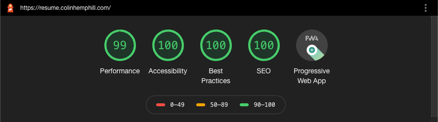

# Next.js Static Generated Résumés

A bootstrapped Next.js application designed to connect your preferred headless CMS and statically generate a clean, professional, and fast web-based résumé. The generator features an API endpoint to download the résumé as a PDF.

[See an example](https://resume.colinhemphill.com)

Your résumé can also generate a secure URL that will display information not accessible on the public URL. The secure version can include private information such as email, phone number, and mailing address. You can send the private link to a potential employer or use it to generate a more complete PDF for yourself.

## Technology

- [Next.js](https://nextjs.org)
- [TypeScript](https://www.typescriptlang.org/)
- [Bootstrap](https://getbootstrap.com/)
- [SASS](https://sass-lang.com/)
- [Font Awesome](https://fontawesome.com/)
- [Jest](https://jestjs.io/)
- [Testing Library](https://testing-library.com/)
- [Vercel](https://vercel.com/)
- [Puppeteer](https://developers.google.com/web/tools/puppeteer)

It also features a simple, effective, and not overbearing dev workflow using ESLint, Prettier, and stylelint.



## Supported Headless CMS Services

The generator currently supports the following headless CMS services:

- [Prismic](https://prismic.io/)
- [Contentful](https://www.contentful.com)

If you'd like support for a different service, please feel free to open a pull request!

## How To Use This Project

The majority of the work you will need to complete is setting up and modifying your preferred headless CMS.

### Set Up Your CMS

Regardless of which supported CMS you choose, or if you are adding support for a new CMS, you will need to set up your schemas to match the expected items.

View our [CMS setup document](README-CMS.md) to see the schemas that you will need alongside the name and description of each required field.

### Deploy Your Résumé

The project is designed to be deployed with [Vercel](https://vercel.com), and you can easily clone the project, set up required environment variables, and deploy instantly with just a couple of clicks! Shipping this project on Vercel enables continuous deployment, their high-performance edge network, and an HTTPS domain for free. A deployment on a different service may require some adjustments to the project.

[](https://vercel.com/new/git/external?repository-url=https%3A%2F%2Fgithub.com%2Fcolinhemphill%2Fnextjs-resume&env=NEXT_PUBLIC_CMS_INTEGRATION,CMS_ENDPOINT,CMS_KEY&envDescription=The%20CMS%20integration%20details%20required%20to%20connect%20your%20r%C3%A9sum%C3%A9%20to%20a%20supported%20headless%20CMS.&project-name=nextjs-resume&repo-name=nextjs-resume&demo-title=Colin%20Hemphill's%20R%C3%A9sum%C3%A9&demo-description=A%20statically%20generated%20professional%20r%C3%A9sum%C3%A9.&demo-url=https%3A%2F%2Fresume.colinhemphill.com&demo-image=http%3A%2F%2Fresume.colinhemphill.com%2Fimg%2FColinHemphill-Logo-SocialShare.png)

#### Environment Variables

Regardless of where the app is deployed, it will need access to the following environment variables:

- `NEXT_PUBLIC_CMS_INTEGRATION`: "prismic" or "contentful"
- `CMS_ENDPOINT`: the API endpoint, "space" name, etc for your CMS repo
- `CMS_KEY`: a secret key that grants the app read access to your CMS
- `PRIVATE_KEY` (optional): this is a code, determined by the author, which will provide URL access to a version of the résumé that includes private information. We recommend generating this code (e.g. a UUID or using a password generator)

#### Webhooks

To maximize the workflow of your generator, an update to the CMS should trigger a fresh build of the static deployment.

If you are using Vercel, simply go to your project, then go to Settings > Git > Deploy Hooks, create a new hook, and copy the URL. Then go to your CMS webhook settings and add the URL to trigger a build when the CMS is updated.

## Private Link

If you include a `PRIVATE_KEY` environment variable in your project, you have access to a secret URL that will display more information than the public URL. Just visit `https://your-url.com/private/your-private-key` to see the private résumé! The private version will include any `private_information` items that you added to the CMS. This is helpful if you want to send a complete résumé to a potential employer or if you want to generate a PDF for your own use. In this version, you can include personal information such as email, phone number, and address that you don't want visible to the general public.

This private URL is _only as secure as the people you send it to_. To invalidate an old private URL, you simply need to change the `PRIVATE_KEY` environment variable.

## Customize Your Résumé

The project ships with a clean and fully WCAG compliant design, but obviously you should feel free to customize it to your personal taste. There are also a couple of places where we are not able to pull information from the CMS, so to optimize your résumé you should consider writing over these.

To modify the project locally, you will need to create a `.env.local` file at the project root with the following, using the same env variables that were required for deployment:

```shell
NEXT_PUBLIC_CMS_INTEGRATION=prismic
CMS_ENDPOINT=https://cms-endpoint.com/
CMS_KEY=cms-secret-key
PRIVATE_KEY=your-private-url-key
```

Then to run the project:

```shell
npm i
npm run dev
```

Global stylesheets are located at `/src/styles`, and basic color variables can be edited at `/src/styles/variables.scss`.

The page structure and PDF generating API are located at `/src/pages`, and most React components are located at `/src/components`. Each component uses SASS modules when custom styles are required, and these styles are located right next to the component.

To modify the document `<head>`, such as modifying Open Graph data or icons, you can edit `/components/PageHead.tsx`.

You should definitely consider updating _everyting_ in the `/public` folder to match your personal brand, including favicon renders in `/public/img/icons/` and `public/favicon.ico`. You should also update `/public/manifest.json` to match your site, as these cannot be updated from the integrated CMS.
